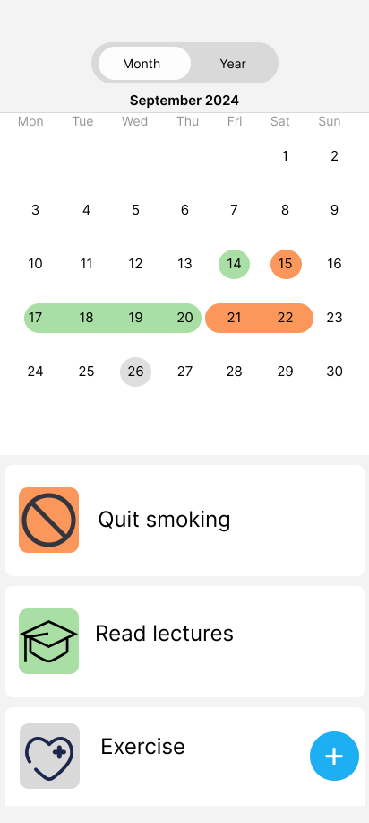
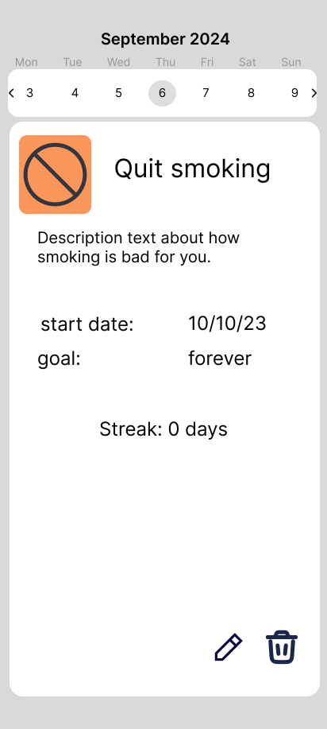
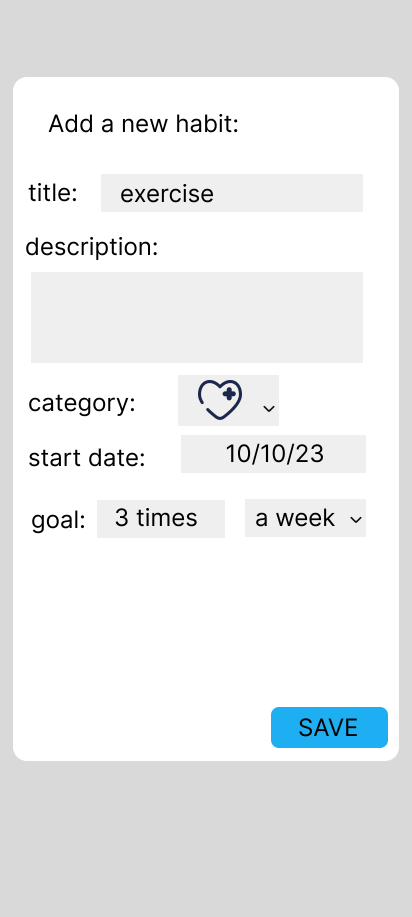
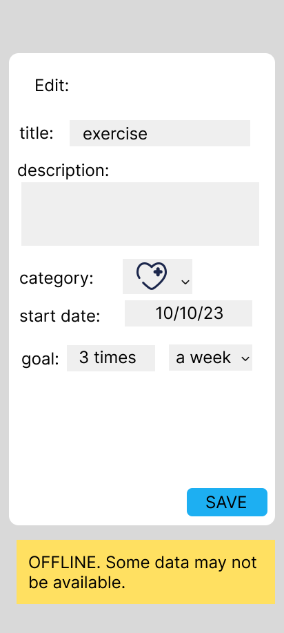

# HABIT TRACKER APP

- A short description. Note that the client is not having a technical background.

The Habit Tracker App is a tool designed to help users build, maintain and monitor daily habits.
Users can create habits they want to track, edit and remove them. They can mark habits as completed
for the day, set goals, and visualize streaks. Reminders can be added to guarantee consistency.

- Domain details. Present the details of the entities that will be persisted. Each field should have a description.

Entity: **Habit**
Attributes:

1. habitID - automatically generated unique identifier
2. title - name of the habit
3. description - brief notes or explanations about the habit (optional)
4. category - category of the habit: academic, work, self, health, social, finance, quit a bad habit
5. startDate - date when the habit was created
6. goal - how many days it should be completed for (or forever)
7. completionData - list of dates in which the habit was completed

- CRUD. Present the details of each crud operation. - create. - read. - update. - delete.
  **CREATE:**
  The user can create a new habit in the following way:

  - press a + icon button, which will open an "Add a new habit" form
  - the form requires input for:
    - **title** (mandatory)
    - **description** (optional)
    - **category** (mandatory; select from existing)
    - **start date** (mandatory; default is "today" but you can select a specific date from a calendar)
    - **goal** (mandatory; either add a number of days/weeks/months or select "Forever")
  - press "Save" button
  - validate input + generate habitID + store new record in the database (completionStatus set to False on create)
  - return to main page, where the habit appears in the list

  **READ:**
  The user can read a habit by viewing it in the habits of the selected day:

  - main page has a week calendar, where users can select a day and the habits for that day will be displayed in a list
  - users can also view habits from the monthly calendar page
  - when a habit is selected, details about that habit are displayed in a popup
  - other than the fields mentioned above, Streaks are also displayed (how many consecutive days the user completed that habit)
  - Streaks can also be visualized on the monthly calendar, filtering by habit
  - if a goal was selected, this is where Progress is calculated and displayed (% of completion)

  **UPDATE:**
  The user can modify information on a specific habit:

  - in the weekly calendar page, the user can mark a habit as completed by tapping on it; it will be sent to the end of the list
    and the current date will be added to completionData
  - users will select a habit, and in the details page, there will be an edit icon
  - the edit form will be pre-populated with the existing habit details
  - users can modify any field title, description, category, startDate, goal. If there are days in which the habit
    was completed BEFORE the new startDate, that data will be lost (warning prompt is shown to the user)
  - after making changes, users will click a "Save Changes" button
  - the system will validate and update the record in the database and the updated record will appear on the home page

  **DELETE:**
  The users can delete a habit:

  - after selecting a habit, on the details page, there will be a trash icon; when tapping it, a warning message will be
    displayed
  - the selected habit and all associated progress will be permanently deleted from the database, and the main pages updated accordingly

- Persistence details, what crud operations are persisted on the local db and on the server.
  Local Database (on device): all operations will be persisted locally so that the app can function offline.
  Server: When the device is connected to the Internet, the data will also be backed up to a server.

- Details on what is happening when the device is offline.
  The app will display a note at the top of every page to notify users that the server is down/there is no internet connection.

  - Create: new habit is saved locally; changes will be synced with server when back online
  - Read: if the server is down, a message will be shown to the user and local data displayed
  - Update/Delete: the local database is updated; changes will be synced with server when back online

- App mockup. Eg. using figma.com or sketch.com or something equivalent. The screenshots should be attached to the assignment.
  
  
  
  
